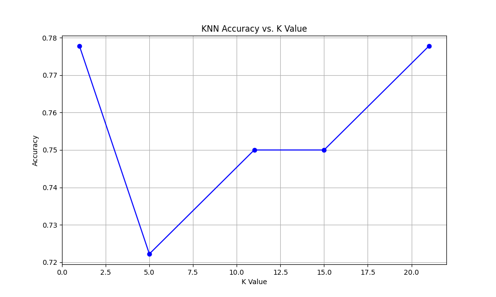
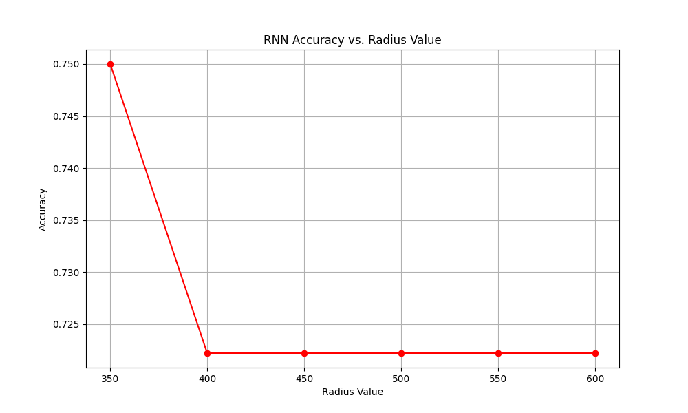
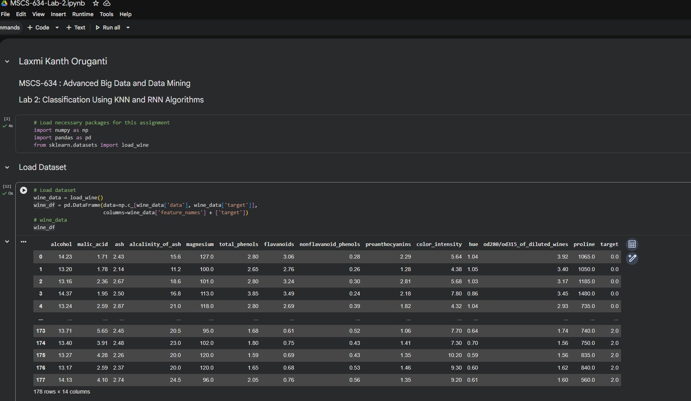
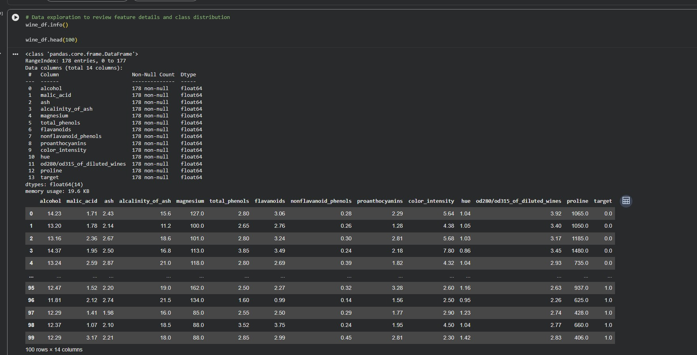
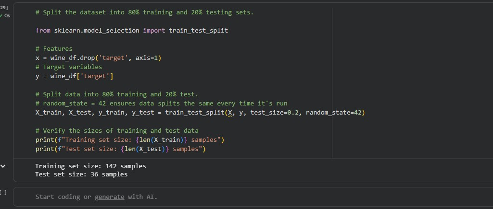
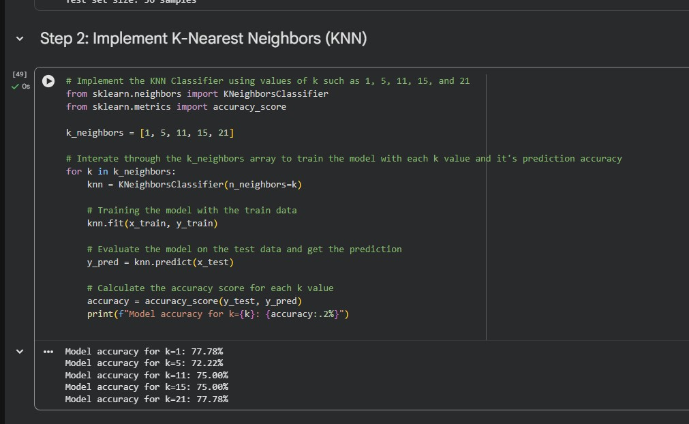
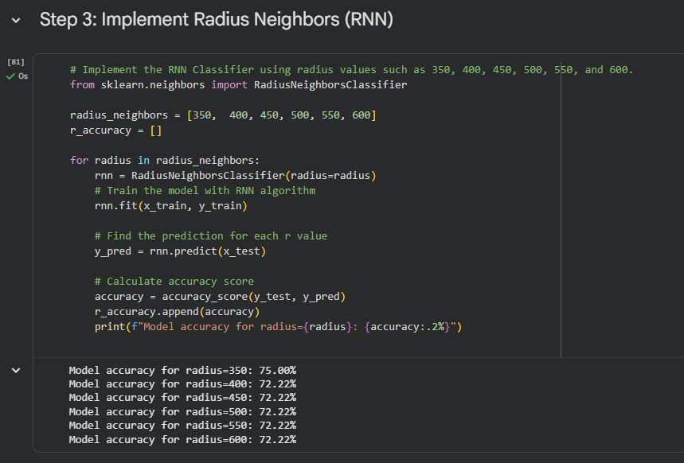
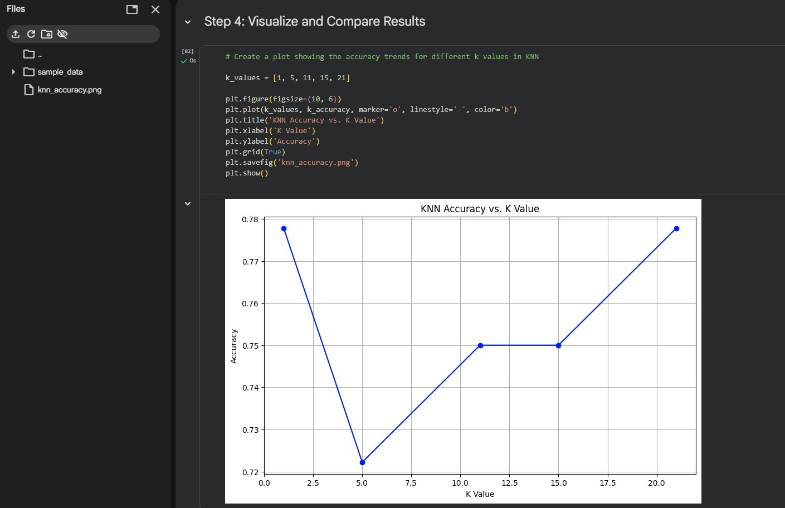
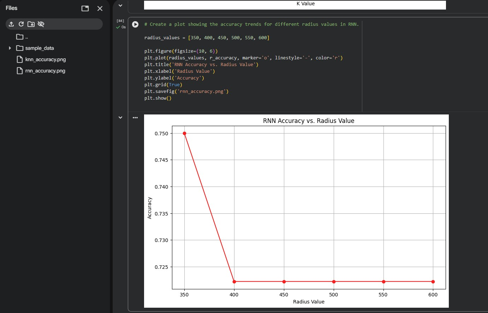

# MSCS 634 - Lab 2: Classification Using KNN and RNN Algorithms

**Laxmi Kanth Oruganti**
**MSCS-634: Advanced Big Data and Data Mining**

## Purpose

In this lab, I worked with the Wine Dataset from sklearn to compare two classification algorithms — K-Nearest Neighbors (KNN) and Radius Neighbors (RNN). The dataset has 178 wine samples with 13 features describing chemical properties, and there are three wine classes. The main goal was to see how changing parameter values (like k in KNN and radius in RNN) affects the accuracy of each model.

## Key Insights

### KNN Accuracy Trends

| K Value | Accuracy |
|---------|----------|
| 1       | 77.78%   |
| 5       | 72.22%   |
| 11      | 75.00%   |
| 15      | 75.00%   |
| 21      | 77.78%   |

- The accuracy for KNN ranged between 72.22% and 77.78% depending on the k value.
- I found it interesting that both k=1 and k=21 gave the highest accuracy (77.78%). I expected k=1 to overfit, but it still did well here.
- The mid-range values like k=5, 11, and 15 had slightly lower accuracy. It seems like either using the closest neighbor or averaging over a larger group works better for this dataset.

### RNN Accuracy Trends

| Radius | Accuracy |
|--------|----------|
| 350    | 75.00%   |
| 400    | 72.22%   |
| 450    | 72.22%   |
| 500    | 72.22%   |
| 550    | 72.22%   |
| 600    | 72.22%   |

- RNN accuracy didn't change much across different radius values. The best result was at radius=350 with 75.00%.
- From radius 400 onwards, the accuracy stayed the same at 72.22%. I think this is because a larger radius pulls in too many neighbors, which makes the predictions less accurate.

### Model Comparison

- Overall, KNN performed a bit better than RNN. KNN reached 77.78% at its best, while RNN topped out at 75.00%.
- I noticed that KNN gave more varied results with different k values, while RNN was more consistent but not as accurate.
- I think one reason RNN didn't do as well is that the features in the Wine Dataset have very different scales — for example, proline goes up to the hundreds while some other features are below 5. This can mess up distance calculations for RNN since it relies on a fixed radius.
- Based on my results, I would say KNN is the better choice when you can experiment with different k values. RNN might be useful in cases where data points are not evenly spread out, but it needs more careful tuning of the radius.

## Screenshots

Below are the screenshots from each step of the lab. All screenshots are in the [Screenshots](Screenshots/) folder:

- **Step 1:** Loading the Wine Dataset
  
- **Step 1:** Basic data exploration — checking feature details and class distribution
  
- **Step 1:** Splitting the dataset into 80% training and 20% testing
  
- **Step 2:** Running KNN and recording accuracy for each k value
  
- **Step 3:** Running RNN and recording accuracy for each radius value
  
- **Step 4:** KNN accuracy trend plot
  
- **Step 4:** RNN accuracy trend plot
  

## Challenges and Decisions

- One challenge I faced was that the features in the Wine Dataset have very different scales. I didn't apply feature scaling in this lab, which probably affected the accuracy of both models. We could try using StandardScaler to normalize the features before training.
